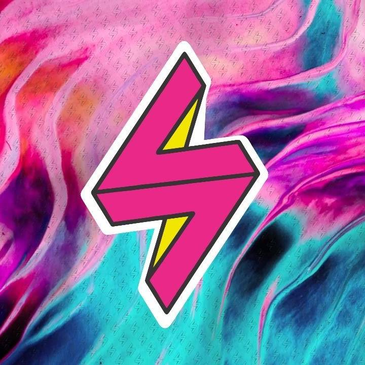
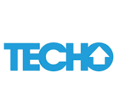
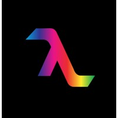

## Voltvisual
- *Front-end Developer* | Dec'19 - Nov'20
- 
- Tags: Work
- Badges:
  - Javascript [yellow]
  - React [cyan]
- List Items:
  - Built the website using React and Redux as main libraries. Combined CSS and Bootstrap to achieve a clean and professional design.
  - Integrated AWS S3 Buckets for scalable and reliable image storage.

## SoyHenry
- *Teaching Assistant* | Aug'21 - Sep'21
- 
- Tags: Education
- Badges:
  - Javascript [yellow]
  - HTML [orange]
  - Completed [green]
- List Items:
  - As a Teaching Assistant at SoyHenry, I guided students during their introductory phase, strengthening their technical skills and enjoying their progress.
  - Fostered collaboration and clear communication in a dynamic, interactive learning environment.

## TECHO
- *Front-end Developer* | Mar'23 - Apr'23
- 
- Tags: Education
- Badges:
  - Typescript [blue]
  - React [cyan]
  - Completed [green]
- List Items:
  - Selected along with my team to participate in a real-world work experience with TECHO, where I was responsible for frontend development.
  - Worked on an ongoing project with an existing codebase, using cutting-edge technologies such as React, Redux, Formik, and Typescript.

## Hollywood SP
- *Full Stack Developer* | Mar'22 - Aug'23
- 
- Tags: Work
- Badges:
  - Javascript [yellow]
  - React [cyan]
  - Firebase [orange]
- List Items:
  - Developed a cross-platform web and mobile application using React and Firebase technologies.
  - Focused on creating a user-friendly interface while ensuring scalability and performance.

## Aythen
- *Tech Leader* | Aug'23 - Mar'24
- 
- Tags: Work
- Badges:
  - Javascript [yellow]
  - Typescript [blue]
  - React [cyan]
  - React Native [cyan]
  - Vue [green]
  - Next.js [white]
- List Items:
  - Held the position of Tech Leader in a cutting-edge project aimed at developing a no-code web builder platform, similar to Framer or Figma, for creating professional websites through a visual editor.
  - Designed and implemented scalable frontend architecture with Clean Code and Clean Architecture principles, ensuring maintainability and performance across a growing codebase.
  - Led the development of an advanced drag & drop system for dynamic layout building, handling complex edge cases for responsiveness and nested structures.
  - Built the application using Next.js, React, Redux Toolkit, and CSS Modules to guarantee modularity, state efficiency, and an optimal developer experience.
  - Spearheaded the framework translation initiative, extending the platform's compatibility to React Native (using Expo) and Vue (using Vite), allowing the same editor logic to generate applications for web and mobile platforms.
  - Mentored team members on best practices, code reviews, and performance optimization strategies, helping raise the team's technical quality standards.
  - Played a key role in refining user experience, improving load times, and ensuring pixel-perfect visual fidelity according to UX/UI design specifications.
